# Proyecto - Gestion de Libreria

Este proyecto es una aplicación de consola en Java para gestionar una libreria. Permite agregar libros a la lista de préstamos, reservar libros, crear pedidos, gestionar usuarios y proveedores, y mas.

## Funcionalidades

1. **Agregar libro a la lista (Prestar Libros):**
   - Permite agregar un libro a la lista de prestamos de la librería proporcionando el título, autor y ISBN del libro.

2. **Mostrar libros de la lista (Libros Prestados):**
   - Muestra todos los libros que estan actualmente prestados y a quién se los presto.

3. **Eliminar el último libro:**
   - Permite eliminar el ultimo libro de la lista de libros disponibles, siempre y cuando no este prestado.

4. **Deshacer eliminacion del último libro:**
   - Permite deshacer la eliminación del ultimo libro, devolviendolo a la lista de libros disponibles.

5. **Agregar usuario:**
   - Permite agregar un usuario a la libreria proporcionando su ID, nombre, direccion y telefono. Verifica que no se ingresen usuarios con IDs repetidos.

6. **Eliminar usuario:**
   - Permite eliminar un usuario de la libreria proporcionando su ID.

7. **Actualizar usuario:**
   - Permite actualizar la informacion de un usuario existente proporcionando su ID, nuevo nombre, nueva direccion y nuevo telefono.

8. **Mostrar usuarios:**
   - Muestra todos los usuarios registrados en la libreria.

9. **Agregar proveedor:**
   - Permite agregar un proveedor a la libreria proporcionando su ID, nombre, dirección y telefono. Verifica que no se ingresen proveedores con IDs repetidos.

10. **Eliminar proveedor:**
    - Permite eliminar un proveedor de la libreria proporcionando su ID.

11. **Mostrar proveedores:**
    - Muestra todos los proveedores registrados en la libreria.

12. **Reservar libro:**
    - Permite reservar un libro de la libreria.

13. **Mostrar libros reservados:**
    - Muestra todos los libros que estan actualmente reservados.

14. **Mostrar libros disponibles:**
    - Muestra todos los libros que estan actualmente disponibles en la libreria.

## Estructura del Proyecto

El proyecto esta organizado en los siguientes paquetes:

- `miPrincipal.modelo`: Contiene las clases de modelo como `Libro`, `Usuario`, `Proveedor`.
- `miPrincipal.servicio`: Contiene la clase `ServicioDatos` que gestiona las operaciones de datos.
- `miPrincipal.iu`: Contiene la clase `MenuOpciones` que maneja la interacción con el usuario.
- `miPrincipal`: Contiene la clase `Libreria` que actúa como una capa de servicio para gestionar las operaciones de la librería.

## Diagrama de clases
[Editor en línea](https://mermaid.live/)

```mermaid
---
title: Diagrama de Clases
---
classDiagram
    class Libreria {
        -ServicioDatos dataService
        -Scanner scanner
        +agregarLibro(Libro libro)
        +eliminarLibro(Libro libro): boolean
        +obtenerLibros(): List<Libro>
        +agregarLibroDisponible(Libro libro)
        +eliminarLibroDisponible(Libro libro): boolean
        +obtenerLibrosDisponibles(): ArrayList<Libro>
        +agregarLibroReservado(Libro libro)
        +eliminarLibroReservado(Libro libro): boolean
        +obtenerLibrosReservados(): ArrayList<Libro>
        +agregarProveedor(Proveedor proveedor)
        +eliminarProveedor(String idProveedor): boolean
        +buscarProveedor(String idProveedor): Proveedor
        +obtenerProveedores(): HashMap<String, Proveedor>
        +agregarUsuario(Usuario usuario): boolean
        +eliminarUsuario(int idUsuario): boolean
        +buscarUsuario(int idUsuario): Usuario
        +obtenerUsuarios(): TreeSet<Usuario>
        +agregarPrestamo(Libro libro, Usuario usuario)
        +eliminarPrestamo(Libro libro): boolean
        +buscarPrestamo(Libro libro): Usuario
        +obtenerPrestamos(): HashMap<Libro, Usuario>
        +eliminarUltimoLibro(): Libro
        +deshacerEliminarLibro(): Libro
    }

    class ServicioDatos {
        -List<Libro> listaLibros
        -Queue<Libro> colaLibros
        -Stack<Libro> pilaLibrosEliminados
        -ArrayList<Libro> listaLibrosDisponibles
        -ArrayList<Libro> listaLibrosReservados
        -HashMap<String, Proveedor> proveedores
        -TreeSet<Usuario> usuarios
        -HashMap<Libro, Usuario> prestamos
        +agregarLibro(Libro libro)
        +eliminarLibro(Libro libro): boolean
        +obtenerListaLibros(): List<Libro>
        +agregarLibroDisponible(Libro libro)
        +eliminarLibroDisponible(Libro libro): boolean
        +obtenerListaLibrosDisponibles(): ArrayList<Libro>
        +agregarLibroReservado(Libro libro)
        +eliminarLibroReservado(Libro libro): boolean
        +obtenerListaLibrosReservados(): ArrayList<Libro>
        +agregarLibroCola(Libro libro): boolean
        +eliminarLibroCola(): Libro
        +obtenerColaLibros(): Queue<Libro>
        +agregarLibroPila(Libro libro)
        +eliminarLibroPila(): Libro
        +obtenerPilaLibrosEliminados(): Stack<Libro>
        +agregarProveedor(Proveedor proveedor): boolean
        +eliminarProveedor(String idProveedor): boolean
        +buscarProveedor(String idProveedor): Proveedor
        +obtenerProveedores(): HashMap<String, Proveedor>
        +agregarUsuario(Usuario usuario): Usuario
        +eliminarUsuario(Usuario usuario): boolean
        +buscarUsuario(int idUsuario): Usuario
        +obtenerUsuarios(): TreeSet<Usuario>
        +agregarPrestamo(Libro libro, Usuario usuario)
        +eliminarPrestamo(Libro libro): boolean
        +buscarPrestamo(Libro libro): Usuario
        +obtenerPrestamos(): HashMap<Libro, Usuario>
    }

    class Libro {
        -int id
        -String titulo
        -double precio
        -String autor
        +getId(): int
        +getTitulo(): String
        +getPrecio(): double
        +getAutor(): String
    }

    class Usuario {
        -int idUsuario
        -String nombre
        -String direccion
        -String telefono
        +getIdUsuario(): int
        +getNombre(): String
        +getDireccion(): String
        +getTelefono(): String
    }

    class Proveedor {
        -int idProveedor
        -String nombre
        -String direccion
        -String telefono
        +getIdProveedor(): int
        +getNombre(): String
        +getDireccion(): String
        +getTelefono(): String
    }

    Libreria --> ServicioDatos
    ServicioDatos --> Libro
    ServicioDatos --> Usuario
    ServicioDatos --> Proveedor
```

[Referencia-Mermaid](https://mermaid.js.org/syntax/classDiagram.html)

## Diagrama de clases UML con draw.io
El repositorio está configurado para crear Diagramas de clases UML con ```draw.io```. Para usarlo simplemente agrega un archivo con extensión ```.drawio.png```, das doble clic sobre el mismo y se activará el editor ```draw.io``` incrustado en ```VSCode``` para edición. Asegúrate de agregar las formas UML en el menú de formas del lado izquierdo (opción ```+Más formas```).

## Uso del proyecto con make

### Default - Compilar+Probar+Ejecutar
```
make
```
### Compilar
```
make compile
```
### Probar todo
```
make test
```
### Ejecutar App
```
make run
```
### Limpiar binarios
```
make clean
```
## Comandos Git-Cambios y envío a Autograding

### Por cada cambio importante que haga, actualice su historia usando los comandos:
```
git add .
git commit -m "Descripción del cambio"
```
### Envíe sus actualizaciones a GitHub para Autograding con el comando:
```
git push origin main
```
## Comandos individuales
### Compilar

```
find ./ -type f -name "*.java" > compfiles.txt
javac -d build -cp lib/junit-platform-console-standalone-1.5.2.jar @compfiles.txt
```
Ejecutar ambos comandos en 1 sólo paso:

```
find ./ -type f -name "*.java" > compfiles.txt ; javac -d build -cp lib/junit-platform-console-standalone-1.5.2.jar @compfiles.txt
```


### Ejecutar Todas la pruebas locales de 1 Test Case

```
java -jar lib/junit-platform-console-standalone-1.5.2.jar -class-path build --select-class miTest.AppTest
```
### Ejecutar 1 prueba local de 1 Test Case

```
java -jar lib/junit-platform-console-standalone-1.5.2.jar -class-path build --select-method miTest.AppTest#appHasAGreeting
```
### Ejecutar App
```
java -cp build miPrincipal.Principal
```
Los comandos anteriores están considerados para un ambiente Linux. [Referencia.](https://www.baeldung.com/junit-run-from-command-line)
